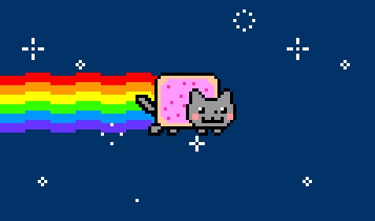
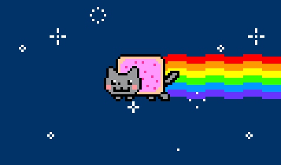

# KImages

## Overview

This library is built off of [processing](https://processing.org) and creates some added functionality. While the
functionality presented is mostly suited for a game, there is a large number of different things in processing this
would be used for. Some notable features include:

- Supports a wider range of file types (Everything supported
  by [Java Advanced Imaging](https://github.com/jai-imageio/jai-imageio-core))
- Images with basic physics and transformation capabilities
- Adds **precision** collision detection between images

## Images

### File support

As stated previously a much wider range of image types are supported by
using [Java Advanced Imaging](https://github.com/jai-imageio/jai-imageio-core)). Most notably, are gifs. While
processing already technically supports gifs, they aren't animated and just appear like this:

But this library animates the gif to look like this (with the help
of [Open-Imaging](https://github.com/DhyanB/Open-Imaging)):

### Resizing

This library uses [Scalr](https://github.com/rkalla/imgscalr) to resize images, as opposed to processing's regular
resize methods. This gives more control for how images should be scaled, as well as better quality and speed. Most
questions about how resizes are done can probably be answered with a quick look at the documentation of Scalr.

## Transformations

The [MovableKImage](src/main/java/kchandra423/movableKImages/MovableKImage.java) class provides several way of
performing basic transformation on images, including translation, rotations, and reflection

## Collision detection

Collision detection between Images is done through the KCollider class. Collision accuracy can be modified, with up to
pixel perfect precision, though this can be very slow.

## Download

This project can be downloaded from the releases section of it's github page, or downloaded directly from
the [dist folder](dist)

## Documentation

Javadocs for this project are available in the [docs folder](docs) are online on
the [GitHub pages for this repo](https://kchandra423.github.io/KImages/)

